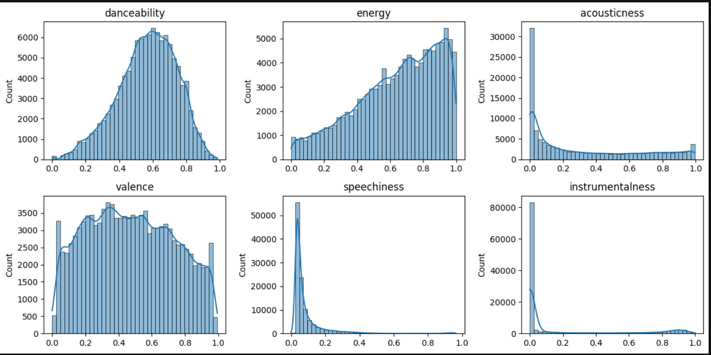

#  Spotify Music Analysis

An exploratory data analysis project investigating what makes a song popular on Spotify — examining audio characteristics, genres, and artists across 114,000+ tracks.

##  Notebook




---

##  Objective

To identify which audio characteristics correlate with track popularity on Spotify — and to understand how popularity varies across genres, artists, and track properties.

---

##  Tech Stack

| Tool | Usage |
|---|---|
| Python (pandas) | Data cleaning & transformation |
| matplotlib | Data visualization |
| seaborn | Statistical plots & heatmaps |
| Jupyter Notebook | Analysis environment |

---

##  Data Source

**Spotify Tracks Dataset** — available on [Kaggle](https://www.kaggle.com/datasets/maharshipandya/-spotify-tracks-dataset)

- 114,000+ tracks, 21 columns
- Audio features: danceability, energy, loudness, tempo, instrumentalness, valence and more
- Metadata: artists, album, genre, explicit flag

---

##  Data Cleaning

- Removed 1 row with missing values in `artists`, `album_name`, `track_name`
- Identified 24,259 duplicate `track_id` entries — one track appearing in multiple genres
- Created `df_unique` (80,293 rows) for correlation analysis to avoid double-counting

---

##  Analysis Structure

**Block A — Dataset Overview**
- Shape, data types, null values, duplicates
- Identified multi-genre track structure

**Block B — Feature Distributions**
- Popularity distribution: right-skewed with large spike at 0
- speechiness and instrumentalness heavily skewed — most tracks have vocals
- valence: nearly uniform distribution — positive and negative tracks equally represented

**Block C — Correlation with Popularity**
- Correlation matrix + heatmap for 8 audio features
- Scatter plots with trend lines for key features

**Block D — Genre & Artist Analysis**
- Top and bottom genres by average popularity
- Top artists by average popularity

**Additional Analysis**
- Explicit content vs popularity
- Track duration vs popularity
- Tempo vs popularity
- Top genres by energy level

---

##  Key Python Techniques

- **df.corr()** — correlation matrix across numeric features
- **seaborn heatmap** — visual correlation matrix with annotations
- **regplot** — scatter plot with trend line
- **groupby + mean + sort_values** — genre and artist aggregations
- **drop_duplicates** — creating clean subset for unbiased correlation analysis

---

##  Key Findings

- **Popularity is hard to predict** — no single audio feature has strong correlation with popularity
- **Vocals matter** — instrumentalness has the strongest negative correlation (-0.19), meaning tracks with vocals are more popular
- **Explicit content is slightly more popular** — avg popularity 36.4 vs 32.9 for non-explicit, likely reflecting hip-hop and R&B dominance
- **Duration and tempo don't matter** — trend lines are nearly flat, hits come in all lengths and speeds
- **Top genres**: pop-film (59.3), k-pop (57.0), chill (53.7) — bottom: classical, new-age, iranian
- **Genre reflects geography** — sertanejo (Brazilian country) in top 10 reflects Spotify's large Brazilian user base
- **Artist collaborations** — top artists are mostly collaborations stored as single entries, which is a dataset limitation

---

##  Repository Structure

```
spotify-music-analysis/
│
├── README.md
└── notebook/
    └── spotify_music_analysis.ipynb    # Full analysis
```

---

## 👤 Author

**Danylo Demchuk**
[LinkedIn](https://www.linkedin.com/in/danylo-demchuk-da) · [GitHub](https://github.com/MelloWingg)
